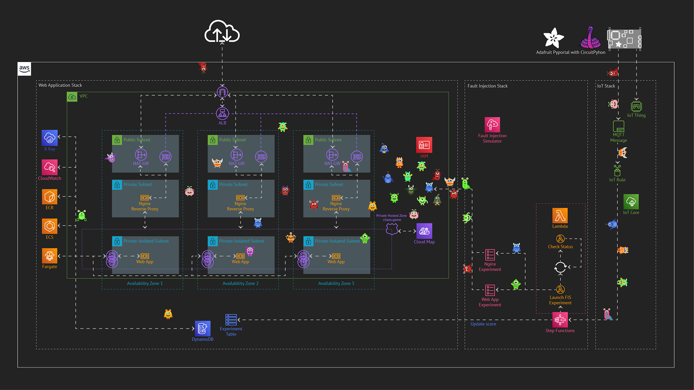

# The AWS Monster Chaos Game
This is a chaos engineering game for AWS developed using the AWS CDK and an 
[Adafruit Pyportal](https://www.adafruit.com/product/4116) microcontroller. It includes:
* A 4 tiers 3 AZs simple web application stack
* A chaos engineering stack to inject failures into the web application stack
* An IoT Stack to register an Adafruit PyPortal microcontroller to AWS IoT Core and trigger chaos experiments 
* A Circuit Python Game for Adafruit PyPortal microcontroller

## The Architecture


## What are the Prerequisites?
The list below is for _Windows_ environment
* Clone this repository
* The AWS CLI ([documentation](https://docs.aws.amazon.com/cli/latest/userguide/getting-started-install.html))
* Docker Desktop ([Documentation](https://docs.docker.com/desktop/windows/install/))
* NPM and Node.js ([Documenttaion](https://docs.npmjs.com/downloading-and-installing-node-js-and-npm))
* The AWS CDK: `npm install -g aws-cdk`

## Setup your Adafruit PyPortal
Please refer to this [README](doc/PYPORTAL.md)

## Deploy the Stacks on AWS
Once you have all the prerequisites, go in the repository folder and perform the steps below.
### Deploy the Stacks on AWS
If you have multiple AWS CLI configuration profiles use the `--profile <your profile name>` to use it for authentication.

Bootsrap the CDK
```
cdk bootstrap aws://<account number>/<aws region>
```

e.g.
```
cdk bootstrap aws://123456789012/eu-west-1
```


Install the Node.js modules defined in the package.json file
```
npm install
```

Verify the stack before deployment
```
cdk synth
```

Deploy the stack
```
cdk deploy --all
```